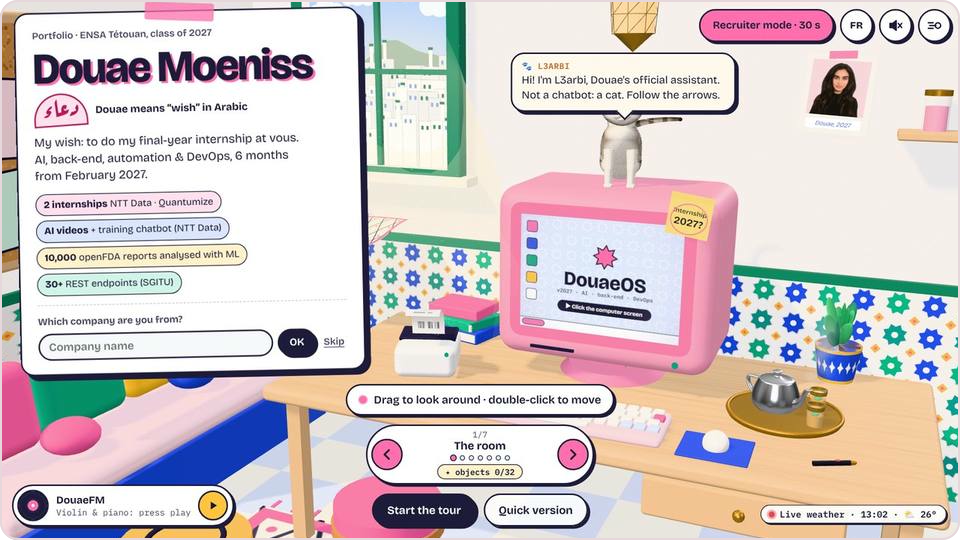
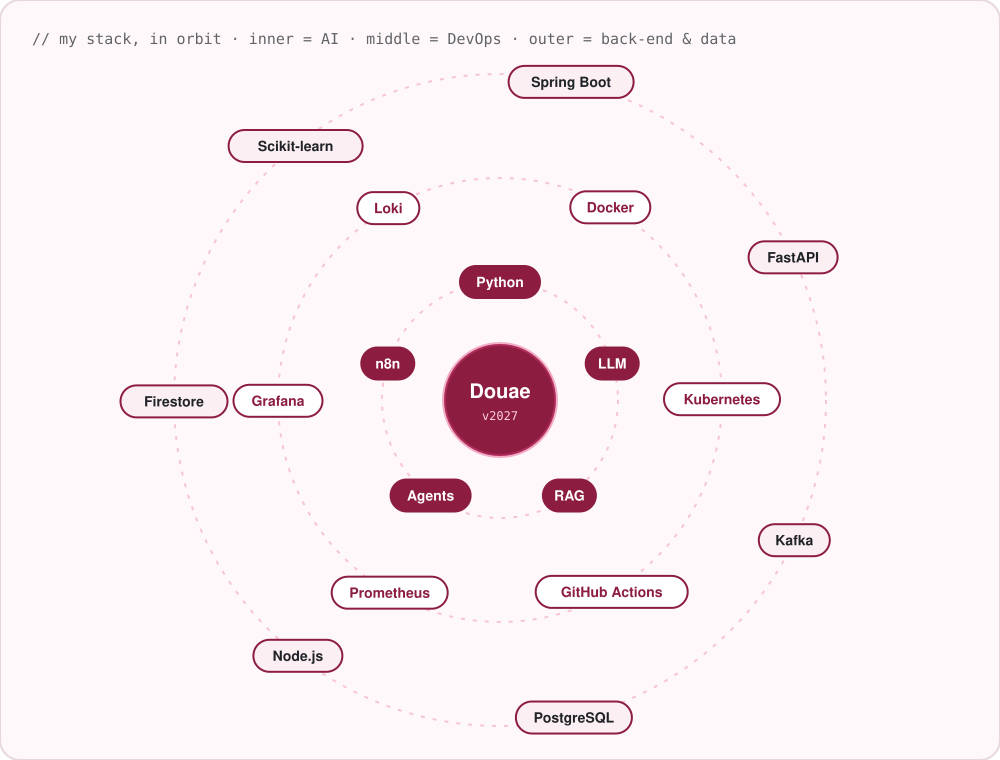

<div align="center">

<a href="https://douae-moeniss.vercel.app/">
  
</a>

[](https://douae-moeniss.vercel.app/)
[](mailto:douae.moeniss@gmail.com)
[](https://www.linkedin.com/in/douae-moeniss-4b4417237/)

</div>

<br/>

<div align="center">

## You've read enough CVs today. Come visit one.

<a href="https://douae-moeniss.vercel.app/">
  
</a>

<a href="https://douae-moeniss.vercel.app/">
  
</a>

<a href="https://douae-moeniss.vercel.app/">
  
</a>

<i>Same person. New format. Walk in.</i>

</div>

---

<div align="center">
  
</div>

<br/>

<details>
<summary><b>📦 <code>$ kubectl apply -f douae.yaml</code> — the full manifest (click)</b></summary>
<br/>

```yaml
apiVersion: engineers/v2027
kind: Intern
metadata:
  name: douae-moeniss
  labels:
    school: ensa-tetouan
    class: "2027"
    focus: ai-automation, devops, llmops
spec:
  availability:
    duration: 6 months
    start: 2027-01
    location: anywhere-in-morocco
  portfolio: https://douae-moeniss.vercel.app   # ← start here
  experience:
    - company: Quantumize        # 2026
      shipped: [whatsapp-ai-accounting-agent, llm-evaluation, llm-cost-optimization]
    - company: NTT Data          # 2025
      shipped: [llm-training-platform-for-300-employees, ai-generated-training-videos, chatbot]
  sidecars:
    - name: l3arbi               # the portfolio cat
      image: cat:latest
      command: ["meow", "--translate", "hire her"]
```

```console
intern.engineers/douae-moeniss created ✨
waiting for condition=Hired ... ⏳ (that part is up to you)
```

</details>

---

## 🛠️ Career pipeline

<div align="center">
  
</div>

---


## 🕹️ Interactive zone

<details>
<summary>🐾 <b>Pet L3arbi</b></summary>
<br/>

> *Rrrrrrr…* **Meow!**
> *(translation: hire her. Also, I want treats.)*
>
> 🐾 Want to pet the real one? **[He lives in my 3D room →](https://douae-moeniss.vercel.app/)**

</details>

<details>
<summary>🧪 <b>Run my test suite</b></summary>
<br/>

```console
$ pytest douae/ -v
test_automates_repetitive_tasks ............ PASSED
test_ships_llms_with_evaluation ............ PASSED
test_keeps_llm_costs_under_control ......... PASSED
test_works_fully_remote .................... PASSED
test_learns_new_stack_fast ................. PASSED
test_drinks_coffee ......................... SKIPPED (prefers tea)
========== 5 passed, 1 skipped in 0.42s ==========
```

</details>

<details>
<summary>🧯 <b>Open incident: INC-2027 "Your team has no PFE intern yet"</b></summary>
<br/>

| | |
|---|---|
| **Severity** | 🔴 High (your backlog keeps growing) |
| **Root cause** | Douae hasn't joined your team yet |
| **Fix** | `git merge douae --into your-team` |
| **ETA** | January 2027 |
| **Owner** | You → [douae.moeniss@gmail.com](mailto:douae.moeniss@gmail.com) |

</details>

<details>
<summary>🔐 <b>sudo hire douae</b></summary>
<br/>

```console
$ sudo hire douae
[sudo] password for recruiter: ********
✔ Access granted.
✔ Drafting internship agreement… (6 months · from January 2027)
→ Final step: send one email to douae.moeniss@gmail.com 📬
```

</details>

---

## 🪐 Toolbox

<div align="center">
  
</div>

---

## 📊 `$ git log --stat`

<div align="center">


<br/>

</div>

<br/>

<div align="center">
  <a href="mailto:douae.moeniss@gmail.com"></a>
</div>
